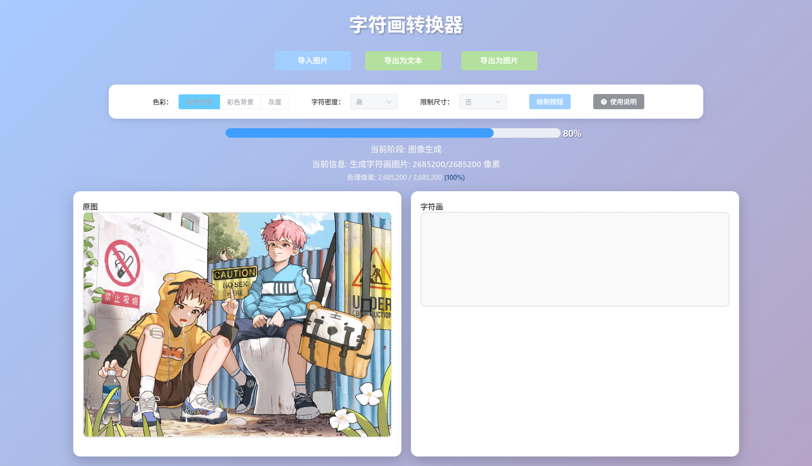

# 字符画转换器

一个功能强大的Web应用，可以将图片转换为字符画，支持静态图片、GIF动图和WebP动图的转换，并提供实时进度显示和多种导出选项。

## 目录

- [字符画转换器](#字符画转换器)
  - [目录](#目录)
  - [功能特点](#功能特点)
  - [项目截图](#项目截图)
  - [项目结构](#项目结构)
  - [技术栈](#技术栈)
    - [前端技术栈](#前端技术栈)
    - [后端技术栈](#后端技术栈)
    - [WebP处理器技术栈](#webp处理器技术栈)
  - [使用说明](#使用说明)
    - [本地部署说明](#本地部署说明)
      - [环境要求](#环境要求)
      - [安装步骤](#安装步骤)
      - [启动服务](#启动服务)
      - [注意事项](#注意事项)
    - [Docker部署说明](#docker部署说明)
    - [配置文件说明](#配置文件说明)
      - [通用配置](#通用配置)
      - [后端服务配置](#后端服务配置)
      - [前端服务配置](#前端服务配置)
      - [WebP处理器配置](#webp处理器配置)
      - [Redis配置](#redis配置)
      - [日志配置](#日志配置)
      - [字符画配置](#字符画配置)
  - [许可证](#许可证)

## 功能特点

- **多格式支持**：支持静态图片（JPG、PNG、BMP等）、GIF动图和WebP动图的转换
- **字符密度调整**：提供低/中/高三种字符密度选项，满足不同细节需求
- **色彩模式**：支持彩色和灰度两种字符画渲染模式
- **实时进度**：使用SSE（Server-Sent Events）技术实时显示转换进度
- **多种导出**：支持导出为字符文本和图片格式
- **流式处理**：使用流式传输提高大图片和动图的处理效率
- **缓存机制**：使用Redis缓存字符画文本，提高重复访问性能
- **现代化界面**：基于Vue 3和Element Plus构建的响应式用户界面
- **容器化部署**：支持Docker和Docker Compose一键部署

## 项目截图





## 项目结构

```text
char-art-converter/
├── frontend/                     # 前端服务 (Vue 3 + Element Plus)
│   ├── public/                   # 静态资源
│   ├── src/                      # 源代码
│   │   ├── api/                  # API调用模块
│   │   ├── assets/               # 资源文件
│   │   ├── App.vue               # 主组件
│   │   └── main.js               # 入口文件
│   ├── .env.example              # 环境变量示例
│   ├── docker-compose.yml        # Docker Compose配置
│   ├── Dockerfile                # Docker镜像构建文件
│   ├── nginx.conf                # Nginx配置
│   ├── package.json              # 依赖配置
│   └── vite.config.js            # Vite配置
│
├── backend/                      # 后端服务 (Spring Boot)
│   ├── src/
│   │   ├── main/
│   │   │   ├── java/com/doreamr233/charartconverter/
│   │   │   │   ├── config/       # 配置类
│   │   │   │   ├── controller/   # 控制器
│   │   │   │   ├── exception/    # 异常处理
│   │   │   │   ├── model/        # 数据模型
│   │   │   │   ├── service/      # 服务接口和实现
│   │   │   │   ├── util/         # 工具类
│   │   │   │   └── CharArtConverterApplication.java  # 启动类
│   │   │   └── resources/        # 资源文件
│   │   └── test/                 # 测试代码
│   ├── docker-compose.yml        # Docker Compose配置
│   ├── Dockerfile                # Docker镜像构建文件
│   └── pom.xml                   # Maven配置
│
├── python_webp_processor/        # WebP处理服务 (FastAPI)
│   ├── api/                      # API接口模块
│   │   ├── health.py             # 健康检查
│   │   ├── progress.py           # 进度监控
│   │   └── webp.py               # WebP处理
│   ├── utils/                    # 工具模块
│   │   ├── scheduler.py          # 任务调度器
│   │   ├── thread_safe_dict.py   # 线程安全字典
│   │   └── utils.py              # 工具函数
│   ├── .env.example              # 环境变量示例
│   ├── config.py                 # 配置文件
│   ├── docker-compose.yml        # Docker Compose配置
│   ├── Dockerfile                # Docker镜像构建文件
│   ├── main.py                   # 应用入口
│   └── requirements.txt          # Python依赖
│
├── Docker.md                     # Docker部署详细文档
├── Dockerfile                    # 一体化Docker镜像构建文件
├── docker-compose.yml            # 一体化Docker Compose配置
├── docker-start.sh               # Docker容器启动脚本
├── nginx.conf.template           # Nginx配置模板
├── supervisord.conf              # 进程管理配置
└── README.md                     # 项目说明文档
```

## 技术栈

### 前端技术栈

- **核心框架**: Vue 3 (Composition API)
- **构建工具**: Vite 4.4.0
- **UI组件库**: Element Plus 2.3.8
- **HTTP客户端**: Axios 1.4.0
- **图标库**: @element-plus/icons-vue 2.3.1
- **实时通信**: Server-Sent Events (SSE)
- **Web服务器**: Nginx (生产环境)
- **容器化**: Docker

### 后端技术栈

- **核心框架**: Spring Boot 2.7.0
- **Web框架**: Spring MVC
- **缓存**: Redis
- **图像处理**:
  - Thumbnailator 0.4.17 (图像缩放)
  - WebP-ImageIO 0.1.6 (WebP格式支持)
  - Animated-GIF-Lib 1.4 (GIF处理)
- **工具库**:
  - Lombok (简化代码)
  - Hutool 5.8.38 (工具集)
  - JSON 20230227 (JSON处理)
- **实时通信**: Server-Sent Events (SSE)
- **容器化**: Docker

### WebP处理器技术栈

- **核心框架**: FastAPI 0.104.1
- **ASGI服务器**: Uvicorn 0.24.0
- **图像处理**: Pillow 10.1.0
- **异步支持**:
  - aiofiles 23.2.0 (异步文件操作)
  - aioredis 2.0.1 (异步Redis客户端)
- **数据验证**: Pydantic 2.5.0
- **实时通信**: sse-starlette 1.6.5
- **任务调度**: APScheduler 3.10.4
- **缓存**: Redis 5.0.1
- **容器化**: Docker

## 使用说明

### 本地部署说明

#### 环境要求

- **前端**: Node.js 14.0.0+, npm 6.0.0+
- **后端**: Java 11+, Maven 3.6+
- **WebP处理器**: Python 3.6+
- **缓存服务**: Redis 6.0+
- **系统要求**: 至少2GB内存，5GB可用磁盘空间

#### 安装步骤

1. **克隆项目**

   ```bash
   git clone https://github.com/yourusername/char-art-converter.git
   cd char-art-converter
   ```

2. **启动Redis服务**

   ```bash
   # Windows (使用Redis for Windows)
   redis-server
   
   # Linux/macOS
   sudo systemctl start redis
   # 或
   redis-server /etc/redis/redis.conf
   ```

3. **安装和启动后端服务**

   ```bash
   cd backend
   
   # 安装依赖并构建
   mvn clean package
   
   # 启动应用
   java -jar target/char-art-converter-1.0.0.jar
   ```

4. **安装和启动WebP处理器**

   ```bash
   cd python_webp_processor
   
   # 安装依赖
   pip install -r requirements.txt
   
   # 启动应用
   python main.py
   ```

5. **安装和启动前端服务**

   ```bash
   cd frontend
   
   # 安装依赖
   npm install
   
   # 开发模式启动
   npm run dev
   
   # 或构建生产版本
   npm run build
   ```

#### 启动服务

启动完成后，各服务将在以下端口运行：

- **前端服务**: <http://localhost:5174> (开发模式) 或 <http://localhost:80> (生产模式)
- **后端服务**: <http://localhost:8080>
- **WebP处理器**: <http://localhost:8081>
- **Redis服务**: localhost:6379

#### 注意事项

- 确保所有服务的端口没有被其他应用占用
- 大型GIF和WebP动图处理可能需要较长时间，请耐心等待
- 建议上传的图片不要超过10MB
- 字符画的质量取决于原图的清晰度和对比度
- 默认使用Redis缓存字符画文本，可以在配置文件中调整缓存时间

### Docker部署说明

推荐使用Docker进行部署，支持一键启动所有服务。详细的Docker部署说明请参阅 [Docker部署指南](./Docker.md)。

**快速启动**：

```bash
# 使用Docker Compose一键部署
docker-compose up -d

# 访问应用
# 前端: http://localhost:80
# 后端API: http://localhost:8080
# WebP处理器: http://localhost:8081
```

### 配置文件说明

#### 通用配置

```bash
# 时区设置
TIMEZONE=Asia/Shanghai

# 上传文件最大大小 (MB)
MAX_UPLOAD_SIZE=10

# 临时文件目录
TEMP_DIR_PATH=/tmp/char-art-converter
```

#### 后端服务配置

```properties
# 服务器配置
server.port=8080
server.servlet.context-path=/

# 文件上传配置
spring.servlet.multipart.max-file-size=10MB
spring.servlet.multipart.max-request-size=10MB

# Redis配置
spring.redis.host=localhost
spring.redis.port=6379
spring.redis.database=0
spring.redis.timeout=2000ms

# 字符画转换配置
char-art.density.low=10
char-art.density.medium=20
char-art.density.high=30
char-art.cache.ttl=3600

# WebP处理服务配置
webp.processor.url=http://localhost:8081
webp.processor.timeout=30000
```

#### 前端服务配置

```bash
# 应用基本信息
VITE_APP_TITLE=字符画转换器
VITE_APP_VERSION=1.0.0

# API配置
VITE_API_BASE_PATH=/api
VITE_API_TIMEOUT=30000

# 上传配置
VITE_MAX_UPLOAD_SIZE=10

# 功能开关
VITE_ENABLE_GIF_SUPPORT=true
VITE_ENABLE_WEBP_SUPPORT=true
VITE_ENABLE_PROGRESS_DISPLAY=true
```

#### WebP处理器配置

```bash
# 服务配置
HOST=0.0.0.0
PORT=8081
DEBUG=false

# Redis配置
REDIS_HOST=localhost
REDIS_PORT=6379
REDIS_DB=0
REDIS_PASSWORD=

# 文件存储配置
UPLOAD_FOLDER=/tmp/webp_uploads
MAX_CONTENT_LENGTH=10485760

# 日志配置
LOG_LEVEL=INFO
LOG_FILE=/var/log/webp_processor.log
```

#### Redis配置

```bash
# Redis服务配置
REDIS_HOST=localhost
REDIS_PORT=6379
REDIS_PASSWORD=
REDIS_DB=0

# 连接池配置
REDIS_MAX_CONNECTIONS=10
REDIS_TIMEOUT=2000

# 缓存配置
CACHE_TTL=3600
CACHE_PREFIX=char_art:
```

#### 日志配置

```bash
# 日志级别
LOG_LEVEL=INFO

# 日志文件路径
BACKEND_LOG_FILE_PATH=/var/log/backend
WEBP_LOG_FILE_PATH=/var/log/webp_processor
SUPERVISORD_LOG_PATH=/var/log/supervisord

# 日志轮转配置
LOG_MAX_SIZE=100MB
LOG_MAX_FILES=10
```

#### 字符画配置

```bash
# 字符密度配置
CHAR_DENSITY_LOW=10
CHAR_DENSITY_MEDIUM=20
CHAR_DENSITY_HIGH=30

# 字符集配置
CHAR_SET_SIMPLE=" .:-=+*#%@"
CHAR_SET_COMPLEX=" .`'^\",:;Il!i><~+_-?][}{1)(|\\/tfjrxnuvczXYUJCLQ0OZmwqpdbkhao*#MW&8%B@$"

# 输出配置
OUTPUT_FORMAT=both
IMAGE_QUALITY=85
FONT_SIZE=12
FONT_FAMILY=monospace
```

## 许可证

[MIT License](LICENSE)
