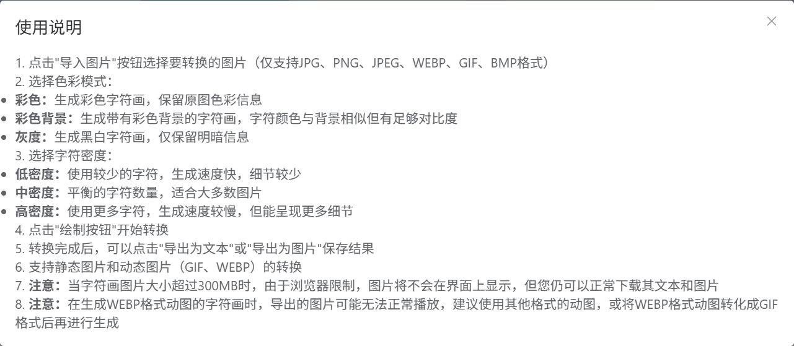

# 字符画转换器

一个功能强大的Web应用，可以将图片转换为字符画，支持静态图片、GIF动图和WebP动图的转换，并提供实时进度显示和多种导出选项。

> **部署说明**: 如需了解如何使用Docker部署本服务，请参阅[Docker部署指南](./Docker.md)。

## 功能特点

- **多格式支持**：支持静态图片（JPG、PNG、BMP等）、GIF动图和WebP动图的转换
- **字符密度调整**：提供低/中/高三种字符密度选项，满足不同细节需求
- **色彩模式**：支持彩色和灰度两种字符画渲染模式
- **实时进度**：使用SSE（Server-Sent Events）技术实时显示转换进度
- **多种导出**：支持导出为字符文本和图片格式
- **流式处理**：使用流式传输提高大图片和动图的处理效率
- **缓存机制**：使用Redis缓存字符画文本，提高重复访问性能

## 项目截图





## 技术栈

### 前端

- **Vue 3**：使用组合式API构建用户界面
- **Element Plus**：UI组件库
- **Axios**：处理HTTP请求
- **Vite**：构建工具和开发服务器

### 后端

- **Spring Boot**：主要应用框架
- **Spring WebFlux**：用于SSE和流式传输
- **Redis**：缓存字符画文本
- **Java AWT/Graphics2D**：图像处理
- **Thumbnailator**：图像缩放处理
- **Animated GIF Library**：GIF动图处理

### Python WebP处理器

- **Flask**：轻量级Web框架
- **Pillow**：图像处理库
- **Docker**：容器化部署

## 项目结构

``` text
char-art-converter/
├── frontend/                # 前端项目
│   ├── public/              # 静态资源
│   ├── src/                 # 源代码
│   │   ├── api/            # API调用
│   │   ├── assets/         # 资源文件
│   │   ├── App.vue         # 主组件
│   │   └── main.js         # 入口文件
│   ├── index.html          # HTML模板
│   ├── package.json        # 依赖配置
│   └── vite.config.js      # Vite配置
│
├── backend/                 # 后端项目
│   ├── src/
│   │   ├── main/
│   │   │   ├── java/com/doreamr233/charartconverter/
│   │   │   │   ├── config/       # 配置类
│   │   │   │   ├── controller/   # 控制器
│   │   │   │   ├── exception/    # 异常处理
│   │   │   │   ├── model/        # 数据模型
│   │   │   │   ├── service/      # 服务接口和实现
│   │   │   │   ├── util/         # 工具类
│   │   │   │   └── CharArtConverterApplication.java  # 启动类
│   │   │   └── resources/        # 资源文件
│   │   └── test/                 # 测试代码
│   └── pom.xml                   # Maven配置
│
└── python_webp_processor/        # Python WebP处理服务
    ├── api/                      # API接口
    ├── utils/                    # 工具函数
    ├── app.py                    # 应用入口
    ├── config.py                 # 配置文件
    ├── requirements.txt          # 依赖列表
    ├── Dockerfile                # Docker配置
    └── docker-compose.yml        # Docker Compose配置
```

## 使用说明

1. 点击"导入图片"按钮选择要转换的图片（支持JPG、PNG、GIF、WebP等格式）
2. 选择字符密度（低/中/高）和色彩模式（彩色/灰度）
3. 点击"绘制"按钮开始转换
4. 转换过程中可以实时查看进度
5. 转换完成后，可以点击"导出为文本"或"导出为图片"保存结果

## 安装指南

### 前端

```bash
# 进入前端目录
cd frontend

# 安装依赖
npm install

# 开发模式运行
npm run dev

# 构建生产版本
npm run build
```

### 后端

```bash
# 进入后端目录
cd backend

# 使用Maven构建
mvn clean package

# 运行应用
java -jar target/char-art-converter-0.0.1-SNAPSHOT.jar
```

### Python WebP处理器

#### 方法1：直接运行

```bash
# 进入Python WebP处理器目录
cd python_webp_processor

# 安装依赖
pip install -r requirements.txt

# 运行应用
python app.py
```

#### 方法2：使用Docker

```bash
# 进入Python WebP处理器目录
cd python_webp_processor

# 使用Docker Compose启动
docker-compose up -d

# 构建Docker镜像
docker build -t python-webp-processor .

# 运行Docker容器
docker run -d -p 5000:5000 --name python-webp-processor python-webp-processor
```

## 环境要求

- **前端**：Node.js 14+
- **后端**：Java 11+, Maven 3.6+, Redis 6+
- **Python WebP处理器**：Python 3.6+ 或 Docker

## 注意事项

- 大型GIF和WebP动图处理可能需要较长时间，请耐心等待
- 建议上传的图片不要超过10MB
- 字符画的质量取决于原图的清晰度和对比度
- 默认使用Redis缓存字符画文本，可以在配置文件中调整缓存时间
- WebP动图处理需要启动Python WebP处理服务

## 许可证

[MIT License](../LICENSE)
